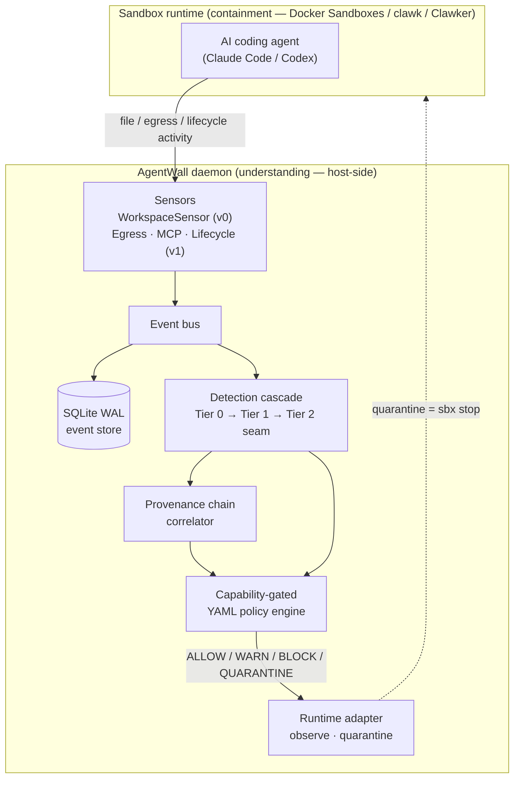
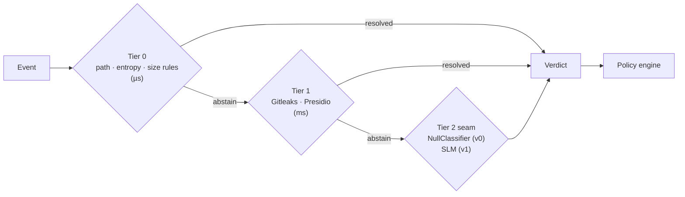
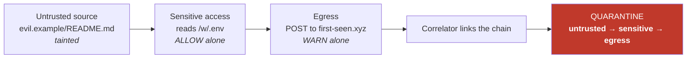
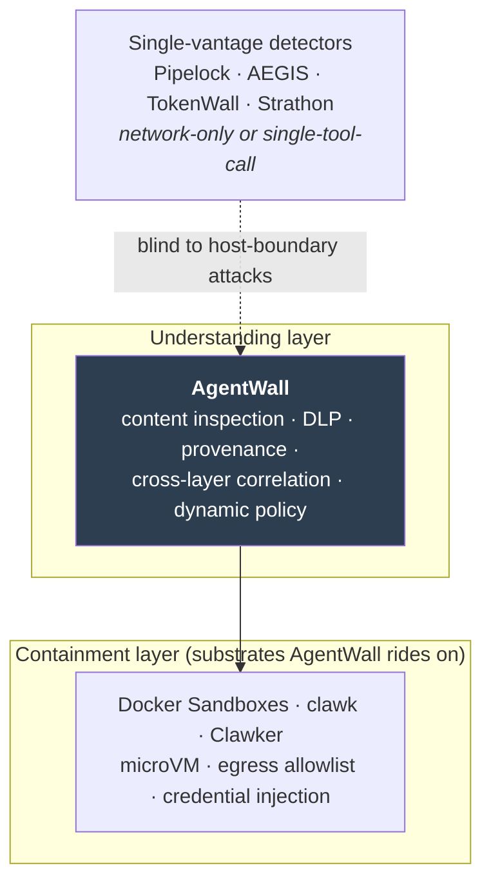

# AgentWall

**The sandbox handles containment — "the agent can't escape." AgentWall handles
understanding — "should it be doing this?"** It rides on top of whichever sandbox
you already use and catches the host-boundary attacks the sandbox model itself
leaves open.

AgentWall is a local-first, host-side security daemon for AI coding agents. It
watches agent activity through sensors, classifies it with a deterministic-first
detection cascade, correlates events into provenance chains, and enforces a
capability-gated YAML policy. It is **not** a sandbox and does not compete with
one.

> **Status: v0 foundation.** The load-bearing skeleton is built and benchmarked;
> several sensors and the Tier-2 classifier are scoped for v1. See
> **[docs/status/v0.md](docs/status/v0.md)** for exactly what ships, what's
> deferred, and the honest caveats.

## Why it exists

Existing agent-security tools watch from a single vantage point — the network,
or one tool call — so they never see an attack that crosses the workspace/host
boundary. The canonical case: a poisoned README tells the agent to read `.env`
and POST it to a new domain. A network-only tool sees only the final HTTP
request, stripped of the fact that it carries secrets sourced from an untrusted
file. AgentWall sees the whole chain.



## How detection works

Events flow through a **deterministic-first cascade** — cheap, exact rules run
first and most events resolve there; the expensive model tier is a seam that
only fires when the cheap tiers abstain. In v0 the Tier-2 seam holds a
`NullClassifier` (always abstain); a small language model drops in for v1
without changing any caller.



Detection alone isn't the differentiator — **correlation across layers is.** The
provenance correlator links events by source-scoped, hash-linked taint, so an
individually-benign sequence becomes a single high-severity chain:



## Not a sandbox — a layer on top of one

Sandbox runtimes do containment; their own docs explicitly disclaim content
inspection, DLP, prompt-injection detection, and provenance. AgentWall is that
missing semantic layer, portable across all of them.



## CLI walkthrough

> Illustrative session. Output shapes are real (captured from the v0 daemon);
> the row-1 attack is driven through the corpus/replay path, since v0 has no
> live EgressSensor yet — see the [v0 status caveats](docs/status/v0.md).

Inspect the active policy — capability-gated rules mapping event classes to
actions:

```console
$ agentwall policy --policy src/agentwall/policy/default_policy.yaml
block-secret-egress: BLOCK
quarantine-exfil-chain: QUARANTINE
warn-sensitive-access: WARN
warn-pii-egress: WARN
```

Health-check the daemon against a workspace — note the runtime adapter only
declares capabilities it can actually enforce:

```console
$ agentwall run --check --workspace . --session dev \
    --db /tmp/aw.db --policy src/agentwall/policy/default_policy.yaml
{'degraded': False, 'events': 0, 'tier2_rate': 0.0, 'capabilities': ['observe', 'quarantine']}
```

As events flow, each gets a verdict — and a correlated exfil chain escalates
past the individual verdicts to QUARANTINE:

```console
verdict=ALLOW       chain=-
verdict=WARN        chain=-
verdict=QUARANTINE  chain=untrusted-source: evil.example/README.md -> sensitive-access: /w/.env -> egress: first-seen.xyz
```

Then summarize and reconstruct what happened in a session:

```console
$ agentwall status --db /tmp/aw.db
events: 3
dead_letters: 0

$ agentwall replay --db /tmp/aw.db --session s1
untrusted-source: evil.example/README.md -> sensitive-access: /w/.env -> egress: first-seen.xyz
```

## Quickstart

```bash
uv sync                 # install dependencies
uv run pytest           # run the test suite (54 tests)

# daemon health check against this workspace (exits without a long-running watch)
uv run agentwall run --check \
  --workspace . --session dev \
  --db /tmp/aw.db --policy src/agentwall/policy/default_policy.yaml
```

Want to see the detection engine catch the attack corpus?

```bash
uv run pytest tests/corpus/test_scenarios.py -v   # row-1 exfil chain, git-hook, package.json, benign control
```

## Documentation

| Doc | What's in it |
|---|---|
| [docs/status/v0.md](docs/status/v0.md) | v0 milestone status — what ships, what's deferred to v1, benchmarks, caveats |
| [docs/superpowers/specs/2026-08-13-agentwall-design.md](docs/superpowers/specs/2026-08-13-agentwall-design.md) | Full design rationale and architecture |
| [docs/spikes/tls-egress.md](docs/spikes/tls-egress.md) | TLS egress inspection spike — verdict that routes v1 egress DLP |
| [docs/sandbox-dev-workflow.md](docs/sandbox-dev-workflow.md) | `make sandbox*` dev tooling for working in a real Docker Sandbox |
